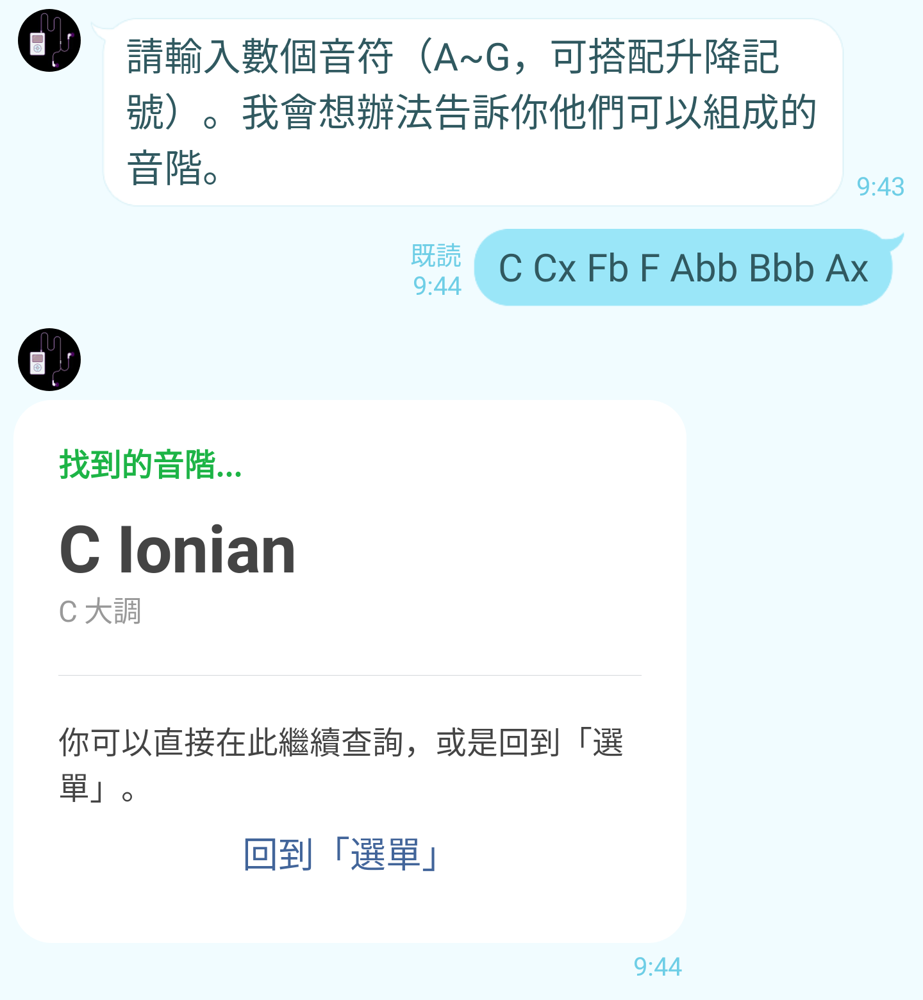

# TOC Project 2020

## 介紹

### 簡單來說...
這個 bot 能~~幫我~~幫使用者查詢各個和弦和音階的組成音，也可以進行反向查詢。
### 功能
一開始會出現選單。可以查詢「和弦名稱」、「和弦組成音」、「音階名稱」還有「音階組成音」。 
> 可以直接點選需要的功能，或是自行輸入。

### 特點
- 懶得打字也可以直接按按鈕\
但是很勤勞當然可以自己打~
  

- 除了認識 A 到 G 七顆音符和升降記號，還認識重升/重降記號。不會混淆降記號(b)和重降記號(bb)。\
或像是重升 C 也認識~ 
  

- 不用依照組成音的音高依序輸入。\
最規則來說應該是 A D E，但有時候就是手殘
  

- 音符之間不用輸入特定的分隔符號。使用空白，或甚至黏在一起也 OK。

### 和弦名稱
 

### 和弦組成音
 

### 音階名稱
 

### 音階組成音
 

## FSM 結構圖
